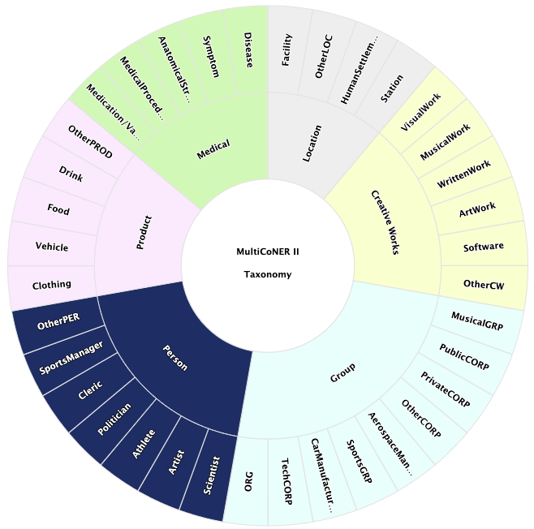

The dataset is publicly available <a href="https://registry.opendata.aws/multiconer" target="_blank">here</a>.

You can download the data using the following command: 
```
aws s3 cp --no-sign-request s3://multiconer/multiconer2023/ multiconer2023/ --recursive
```

## Tagset
The tagset of MultiCoNER is a fine-grained tagset. 

The fine to coarse level mapping of the tags are as follows:

* **Location (LOC)** : Facility, OtherLOC, HumanSettlement, Station
* **Creative Work (CW)** : VisualWork, MusicalWork, WrittenWork, ArtWork, Software
* **Group (GRP)** : MusicalGRP, PublicCORP, PrivateCORP, AerospaceManufacturer, SportsGRP, CarManufacturer, ORG
* **Person (PER)** : Scientist, Artist, Athlete, Politician, Cleric, SportsManager, OtherPER
* **Product (PROD)** : Clothing, Vehicle, Food, Drink, OtherPROD
* **Medical (MED)** : Medication/Vaccine, MedicalProcedure, AnatomicalStructure, Symptom, Disease

The following figure shows the fine-grained taxonomy of the dataset.



Here are some examples from the dataset.

```
* Bangla: [লিটল মিক্স | MusicalGrp] এ যোগদানের আগে তিনি [পিৎজা হাট | ORG] এ ওয়েট্রেস হিসাবে কাজ করেছিলেন।
* Chinese: 它的纤维穿过 [锁骨 | AnatomicalStructure] 并沿颈部侧面倾斜向上和内侧.
* English: [wes anderson | Artist]'s film [the grand budapest hotel | VisualWork] opened the festival .
* Farsi:     است] ناگویا |HumanSettlement] مرکزاین استان شهر
* French: l [amiral de coligny | Politician] réussit à s y glisser .
* German: in [frühgeborenes | Disease] führt dies zu [irds | Symptom] .
* Hindi: १७९६ में उन्हें [शाही स्वीडिश विज्ञान अकादमी | Facility] का सदस्य चुना गया।
* Italian: è conservato nel [rijksmuseum | Facility] di [amsterdam | HumanSettlement] .
* Portuguese: também é utilizado para se fazer [licor | Drink] e [vinhos | Drink].
* Spanish: fue superado por el [aon center | Facility] de [los ángeles | HumanSettlement] .
* Swedish: [tom hamilton | Artist] amerikansk musiker basist i [aerosmith | MusicalGRP] .
* Ukrainian: назва альбому походить з роману « [кінець дитинства | WrittenWork] » англійського письменника [артура кларка | Artist] .
```


## Data Statistics
<table style="width:60%">
  <tr>
    <th>Language</th>
    <th>Training</th>
    <th>Validataion</th>
    <th>Test</th>
  </tr>


  <tr>
    <td>BN-Bangla</td>    
    <td>9,708</td>
    <td>507</td>
    <td>19,859</td>
  </tr>
  
  <tr>
    <td>DE-German</td>
    <td>9,785</td>
    <td>512</td>
    <td>20,145</td>
  </tr>
  
  <tr>
    <td>EN-English</td>
    <td>16,778</td>
    <td>871</td>
    <td>249,980</td>
  </tr>
    
  <tr>
    <td>ES-Spanish</td>
    <td>16,453</td>
    <td>854</td>
    <td>246,900</td>
  </tr>
  
  <tr>
    <td>FA-Farsi</td>
    <td>16,321</td>
    <td>855</td>
    <td>219,168</td>
  </tr>
  
  <tr>
    <td>FR-French</td>
    <td>16,548</td>
    <td>857</td>
    <td>249,786</td>
  </tr>
  
  <tr>
    <td>HI-Hindi</td>
    <td>9,632</td>
    <td>514</td>
    <td>18,399</td>
  </tr>
  
  
  <tr>
    <td>IT-Italian</td>
    <td>16,579</td>
    <td>858</td>
    <td>247,881</td>
  </tr>
  
  <tr>
    <td>PT-Portuguese</td>
    <td>16,469</td>
    <td>854</td>
    <td>229,490</td>
  </tr>
  
  <tr>
    <td>SV-Swedish</td>
    <td>16,363</td>
    <td>856</td>
    <td>231,190</td>
  </tr>
  
  <tr>
    <td>UK-Ukrainian</td>
    <td>16,429</td>
    <td>851</td>
    <td>238,296</td>
  </tr>
  
  <tr>
    <td>ZH-Chinese</td>
    <td>9,759</td>
    <td>506</td>
    <td>20,265</td>
  </tr>
  
  <tr>
    <td>MULTI-Multilingual</td>
    <td>170,824</td>
    <td>8,895</td>
    <td>358,668</td>
  </tr>
  

</table>


 

<!--
## To get the training data, please check the Codalab sites.
You have to register in the Codalab site, then check the Participate tab.

<!--
<a href="https://competitions.codalab.org/competitions/36044" target="_blank">Training and Dev</a>

<!--<a href="https://competitions.codalab.org/competitions/36425" target="_blank">Test</a>-->


<!--
## Training Data Download
<iframe src="https://docs.google.com/forms/d/e/1FAIpQLSeCknzrVSoYQX4YHypU8ZNvRw2WzE6KHDSIRfnikgC9kVXniQ/viewform?embedded=true" width="640" height="2000" frameborder="0" marginheight="0" marginwidth="0">To get the training data, please fill out the form below</iframe>
-->

<!--<iframe src="https://docs.google.com/forms/d/e/1FAIpQLSfAYk1uhMdE5ft54IDKy_wxiMKzBdweNVg1JxDZqqpt-KNZjA/viewform?embedded=true" width="640" height="2000" frameborder="0" marginheight="0" marginwidth="0">To get the training data, please fill out the form below</iframe>-->


### Communication
* Join us in <a href="https://join.slack.com/t/multiconer/shared_invite/zt-vi3g97cx-MpqTvS07XX22S78nRC2s0Q">Slack</a>

* Subscribe to the [task mailing list](mailto:multiconer-semeval@googlegroups.com)

* [Contact the organizers](mailto:multiconer-semeval-organizers@googlegroups.com)