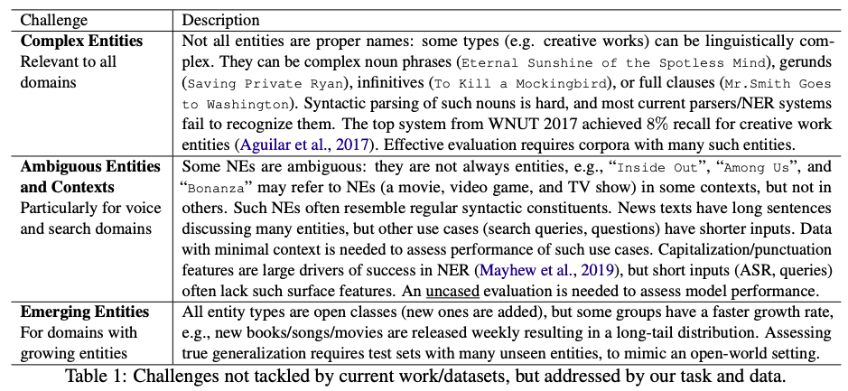

This shared task challenges NLP enthusiasts to develop complex Named Entity Recognition systems for **11** languages. The task focuses on detecting semantically ambiguous and complex entities in short and low-context settings. Participants are welcome to build NER systems for any number of languages. And we encourage to aim for a bigger challenge of building NER systems for multiple languages. The languages are: **English, Spanish, Dutch, Russian, Turkish, Korean, Farsi, German, Chinese, Hindi**, and **Bangla**. For some languages, an additional track with code-mixed data will be offered.
The task also aims at testing the domain adaption capability of the systems by testing on additional test sets on questions and short search queries.

**Highlights of the task**
* Task organizers will provide entity annotated training data for 11 languages. 
* Participants can use the data to build NER model for one or more languages.
* Task organizers will provide test data without the annotations. The participants have to use their systems to correctly detect the entities and submit the predictions to Codalab page.
* Task organizers will rank the submissions based on their performance on each language, separately.
* Participants are encouraged to aim for a bigger challenge to build NER systems for multiple languages. It can be one model per language or a single model for multiple languages.

## Motivation

Processing complex and ambiguous Named Entities (NEs) is a challenging NLP task in practical and open-domain settings, but has not received sufficient attention from the research community.
{: style="text-align: justify"}

Complex NEs, like the titles of creative works (movie/book/song/software names) are not simple nouns and are harder to recognize (Ashwini and Choi, 2014). They can take the form of any linguistic constituent, like an imperative clause (“Dial M for Murder”), and do not look like traditional NEs (Person names, locations, organizations). This syntactic ambiguity makes it challenging to recognize them based on their context. Such titles can also be semantically ambiguous, e.g., “On the Beach” can be a preposition or refer to a movie. Finally, such entities usually grow at a faster rate than traditional categories, and emerging entities pose yet another challenge. Table 1 lists more details about these challenges, and how they can be evaluated.
{: style="text-align: justify"}

Neural models (e.g., Transformers) have produced high scores on benchmark datasets like CoNLL03/OntoNotes (Devlin et al., 2019). However, as noted by Augenstein et al. (2017), these scores are driven by the use of well-formed news text, the presence of “easy” entities (person names), and memorization due to entity overlap between train/test sets; these models perform significantly worse on complex/unseen entities. Researchers using NER on downstream tasks have noted that a significant proportion of their errors are due to NER systems failing to recognize complex entities (Luken et al., 2018; Hanselowski et al., 2018).
{: style="text-align: justify"}

## References
* Sandeep Ashwini and Jinho D. Choi. 2014. [Targetable named entity recognition in social media](https://arxiv.org/pdf/1408.0782.pdf). _CoRR, abs/1408.0782_.
* Jacob Devlin, Ming-Wei Chang, Kenton Lee, and Kristina Toutanova. 2019. [BERT: pre-training of deep bidirectional transformers for language understanding](https://aclanthology.org/N19-1423.pdf). _In NAACL-HLT (1). Association for Computational Linguistics_.
* Isabelle Augenstein, Leon Derczynski, and Kalina Bontcheva. 2017. [Generalisation in named entity recognition: A quantitative analysis](https://arxiv.org/pdf/1701.02877.pdf). _Computer Speech & Language, 44:61–83_.
* Jackson Luken, Nanjiang Jiang, and Marie-Catherine de Marneffe. 2018. [QED: A fact verification system for the FEVER shared task](https://aclanthology.org/W18-5526.pdf). _In Proceedings of the First Workshop on Fact Extraction and VERification (FEVER), pages 156–160, Brussels, Belgium. Association for Computational Linguistics_.
* Andreas Hanselowski, Hao Zhang, Zile Li, Daniil Sorokin, Benjamin Schiller, Claudia Schulz, and Iryna Gurevych. 2018. [UKP-athene: Multi-sentence textual entailment for claim verification](https://aclanthology.org/W18-5516.pdf). _In Proceedings of the First Workshop on Fact Extraction and VERification (FEVER), pages 103–108, Brussels, Belgium. Association for Computational Linguistics_.

### Communication
* Join us in <a href="https://join.slack.com/t/multiconer/shared_invite/zt-vi3g97cx-MpqTvS07XX22S78nRC2s0Q">Slack</a>

* Subscribe to the [task mailing list](mailto:multiconer-semeval@googlegroups.com)

* [Contact the organizers](mailto:multiconer-semeval-organizers@googlegroups.com)

## Anti-Harassment Policy
SemEval highly values the open exchange of ideas, freedom of thought and expression, and respectful scientific debate. We support and uphold the [NAACL Anti-Harassment policy](http://naacl.org/policies/anti-harassment.html){:target="_blank"}. Participants are encouraged to send any concerns or questions to the [NAACL Board members](http://naacl.org/officers/){:target="_blank"}, [Priscilla Rasmussen](mailto://acl@aclweb.org){:target="_blank"} and/or the [workshop organizers](https://semeval.github.io/SemEval2022/){:target="_blank"}.
{: style="text-align: justify"}

